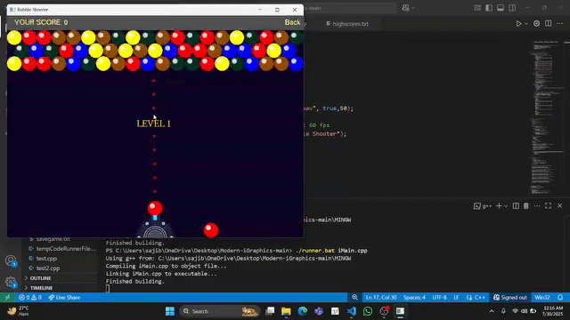

<h1 align="center">🎮 Bubble Shooter</h1>

  

  <i>A remake of the legendary "BUBBLE SHOOTER" game completely in C language using the iGraphics framework.</i>

## Overview
This project is a classic arcade-style Bubble Shooter game. It was developed to demonstrate core programming concepts, physics, and graphics movement logic using **C** and the **iGraphics** framework (a wrapper built on top of OpenGL used in BUET lab works). Don't get confused by the .cpp extension as .cpp supports C as well.

## Features
- Classic bubble shooting mechanics to simulate shooting, exchange and popping of bubbles, saving sessions using files, etc.
- Real-time aiming and shooting interactions using real time colored bubbled grid and shooting, reflecting trajectory
- Used manual BFS logic in C from scratch for gameplay logic
- Built completely from scratch in C

## Tech Stack
- **Language:** C 
- **Graphics Framework:** iGraphics (OpenGL)
- **IDE:** Code::Blocks / Visual Studio 

## 🕹️ How to Play
1. **Direct Play:** Simply download and run the `Bubble_shooter_play.exe` file on any Windows machine.
2. **Aim:** Move your mouse cursor to aim the bubble.
3. **Shoot:** Click the **Left Mouse Button** to fire. Other instructions ar available in the game.

## 💻 How to Compile (For Developers)
If you want to explore or edit the source code:
1. Set up **Code::Blocks** or **Visual Studio** with the necessary iGraphics and OpenGL configurations.
2. Open `iMain.cpp` in your IDE.
3. Build and run the project(you can use runner bat )

  <b>Developed & Maintained by <a href="https://github.com/sajibmrbitz">Mahmodur Rahman Sajib</a> &
    <a href="https://github.com/Ifat-monday-128">Mahtab Hasan Ifat</a></b> 
